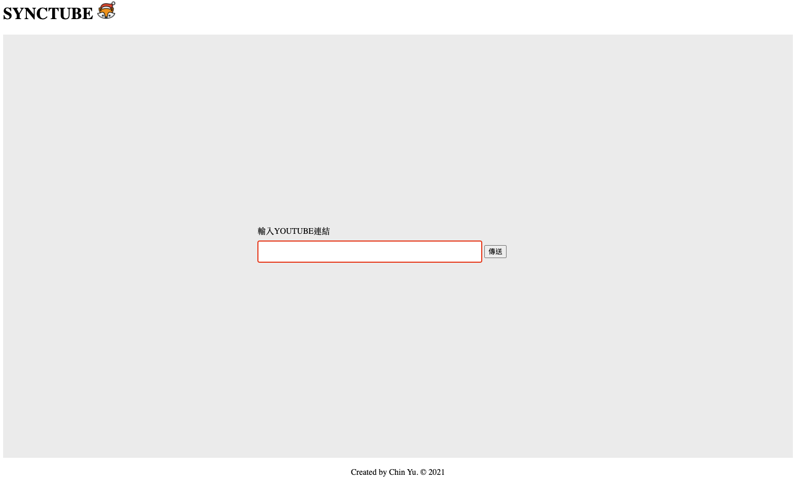
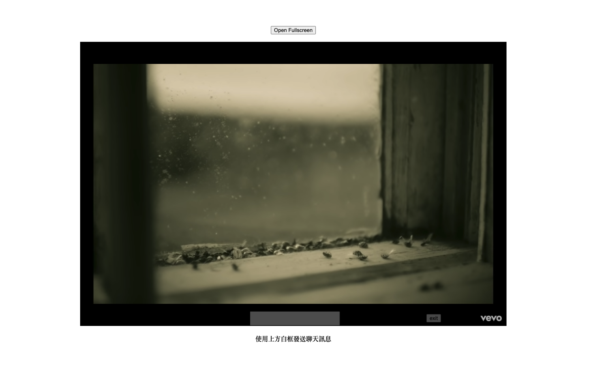
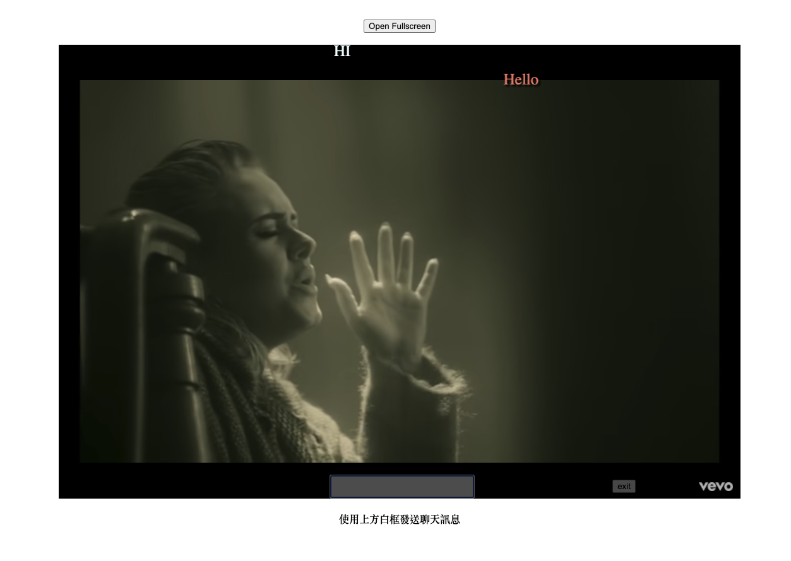

# SyncTube-with-Bullet-screen

## About The Project
使用Golang開發後端環境，主要功能為：
1. YouTube畫面同步顯示（時間軸同步）
2. 發送留言並且用彈幕顯示在YT畫面上
3. 傳送連結給朋友就可以開始同步使用

### Built With
* BackEnd : Golang , javascript
* FrontEnd: HTML
* API : YouTube - IFrame Player API
  * https://developers.google.com/youtube/iframe_api_reference


## Getting Started

### Prerequisites
Golang import

Use `go get`
```
"github.com/gorilla/websocket"
"github.com/satori/go.uuid"
"github.com/gorilla/mux"
```

### Execute
```shell
go build websocketHandler.go
```
website:
```
http://localhost:8080
```

## Introduction

### Home Page
輸入YouTube影片連結，會跳轉到影片頁面


### Sync page
#### main
若網址輸入正確，會產生一組唯一的code，讓其他人進入到此網址，同步收看輸入的YouTube影片


#### Bullet screen
使用YT下方白框輸入聊天內容，會以彈幕方式出現在影片畫面上




## Project Illustration
主要使用websocket實現client廣播功能

詳細說明註解在`websocketHandler.go`中，以下說明重點內容

### GO

1. 將所有client訊息保存下來
   * id
   * socket
   * 要傳送的聊天（彈幕）內容


2. 建立一個Manager去保存client 資料，包含了1.的內容與boardcast儲存每個client需要廣播給其他client的內容
   * 這裡使用go語言的channel去實現（goroutine溝通） 


3. Manager實現`start()`method，用來listen是否有client進入or關閉，也處理是否有client傳入訊息到broadcast channel
   * broadcast channel: 處理channel的訊息，並把內容廣播到client端send channel內 
   

4. 當有Client進入（有人打開指定web），就開啟兩個 goroutine 
   * read routine: 讀取client端傳送的訊息（彈幕與目前影片時間），並把內容傳送至broadcast channel
   * write routine: 將send的內容傳送給web端


5. main()
   * 開啟Manager 的 `start()`
   * Set handler


### javascript

1. 開啟websocket功能
2. listen event
   * open event
   * close event
   * message event

3. 接收訊息 傳送訊息
   * 以json處理收到的訊息
   * 拆解訊息，判斷是Time or 彈幕訊息

4. YouTube player API
   * URL 解析
   * 解析出影片的ID
   * 設定播放event
   * 傳送目前影片時間到server
   * `seek()`實現跳轉時間功能


